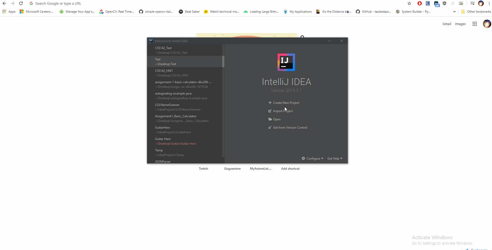

# CSS142_HW1

## Summary
This is a brief warm-up exercise regarding branching.

## Work Item
Given the following variable declarations and main method skeleton driver below in "Main Method
Skeleton Driver", code up “if” statements that correspond with each of the "Questions" below. (A
driver is a program whose purpose is to run other code, in this case, the "if" statements.) Compile
and execute your code to prove it’s correct. Use a Scanner for reading in from the keyboard. Submit
the single Java file (i.e., “.java” text file) that contains your code:
Please submit only a single Java file via Canvas. Do not email your instructor your work.
Name your Java file HW_WarmUp.java. You must name your file this way.
Note that by requiring you name your Java file HW_WarmUp.java, it means that the public class
that is in that file has to be named HW_WarmUp .
There is no flow chart for this assignment.

## Questions
1. Prompt the user with: "Enter the number". Determine if it is negative and if so, print: "The
number is negative." Use a Scanner to collect the input, and report to the console if the variable
called “number” is negative using System.out.println().
2. Prompt the user with: "Enter a second number". Determine if the number is zero and if so, print:
"The number is zero." Use a Scanner to get the input, and report if the number is zero next.
You can reuse the variables "number" and "keyboard" here.
3. Continue to use Scanner for input. Prompt the user with: "Enter a third number, a double, for the
class average." Determine if the class average is a passing grade, and if so, print: "A passing
grade", and print to the console otherwise if not (not passing is if the class average was below a
65).
4. Prompt the user with: "Is the answer the user reported true? Enter a Boolean value." Store the
value in the variable called "answer". Let the user know if the value in the variable “answer” is
true by printing an appropriate message to the console.
5. Starting with the "if" statement you built in the previous problem, add an "else" clause to it so
that if the answer was false, your program will output "The value was false" instead.
6. Ask the user for a number and then determine if the number is even or odd. Print out “the
number is even” if the “number” variable holds an even value, else { print out “the number is
odd” }
7. Ask the user for a float value that will represent a grade and determine if the grade is in the “A”
range. Print to the console “The grade is above an X” (where X is the minimum value for an "A"
grade) if the grade is an “A”. (You can decide for yourself what percentage is an "A" grade.)
8. Add to the previous "if" statement so that it becomes an "if/else" or multi-way if/else structure
that will now also test to see if the grade is a “B”. Output to the console if the grade is in that
range. (While you don't necessarily have to use the logical "and" operator to solve this problem,
note that in Java the "and" operator is represented by “&” or “&&”.) You can decide for yourself
what percentage is a "B" grade.
9. Ask the user for a temperature, stored in a double. Is the temperature higher than 78 degrees
or less than (or equal to) 78 degrees? Describe the current temperature as “higher than 78
degrees” or “less than or equal to 78 degrees”.
10. For the temperature, write an "if/else" statement that asks if the temperature is (positive & odd)
OR (zero & even)? (Notice the use of parenthesis here to define operator precedence. Look up
order of operations (PEMDAS), "logical AND," and “logical OR” if this is unfamiliar in your text).
If it is, output “yes; positive and odd or zero and even” and if it’s not, say “no; not positive and
odd or zero and even” on the console.
11. Prompt the user for a letter grade and store this in a char. Then, write a multi-way "if" statement
that ends in a catch-all if a non-existent letter grade (i.e., not A, B, C, D, F) is entered. The
multi-way "if" asks: Is the grade an “A”? Else is the grade a “B”? Else is the grade a “C”? Else
is the grade a “D”? Else is the grade an “F”? For each case, print an appropriate message to
screen as to what letter grade was entered (or if a non-existent grade was entered). Notice the
use of the word else in the sentence above, which provides for a more precise meaning. In
spoken English we might use the word “or” instead, but of course, English is terribly ambiguous
and Java needs to be discrete, deterministic, and precise.
12. Write a function called “max” that takes two integers as input and returns the larger of the two.
That is, complete the function “public static int max(int a, int b) {“ so that it returns the larger of a
or b using an “if” statement.
13. Ask the user for two integers using a Scanner and report the largest and smallest values using
the max function you just built. Consider the following output:
//sample output for problem 13
Enter two integers: 2 14
Largest is 14
Smallest is 2

## Grading
Each item is given zero, half or 1 point. For this assignment, points are awarded strictly based on
whether your program is correctly written to produce the correct results. You will not be graded on
style, though you should always practice good programming style.

## Additional Hints
Always compile and run/test your code after each incremental change.
Never write a whole program first and then compile and test later.

## Initial Setup
Accept the assignment: https://classroom.github.com/a/RzC1asr_
Go to your assignment repository.

Clone the starter code onto your desktop with GitBash. You can get GitBash here: https://gitforwindows.org/
To configure 
Change directory to your desktop and clone your repository by executing each of these commands separately.
```
cd Desktop/
git clone <HTTPS URL>
```
You can find the HTTPS URL here:


You may be prompted for your login information so enter that in.

Start a new project on IntelliJ and name it how ever you want. 
Create a new directory name "Tests" and mark the directory as "Test Sources Root"


Drag and drop the HW_WarmUp.java file from your downloaded repository on your Desktop, to the src folder in your project.
Drag and drop the HW_WarmUpTest.java file from your downlaoded repository on your Desktopm to the Test folder you created in your project.

## Submitting your assignment
When you feel like you have a working solution, replace the HW_WarmUp.java file you worked on in your project back into the repository you cloned during setup. 

Execute the following commands on GitBash:
```
cd Desktop/
git add HW_WarUp.java
git commit -m "My submission"
git push
```


About this Document
By Rob Nash, et al., January 2016, with minor edits by Johnny Lin, last December 2017.

GitHub Submissions
By David Liu, May 2020
